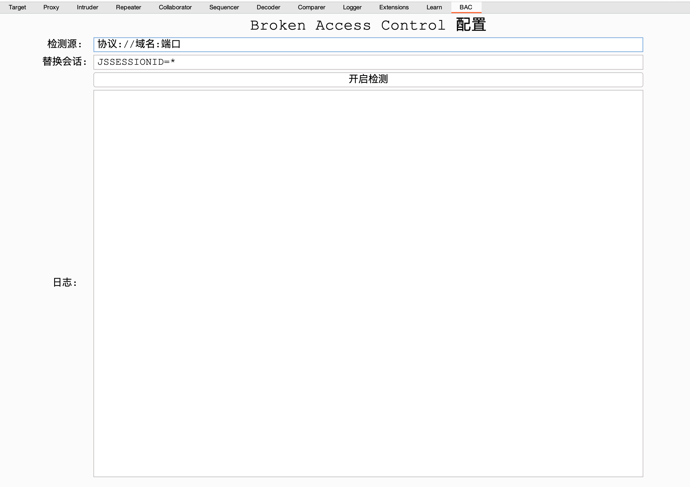
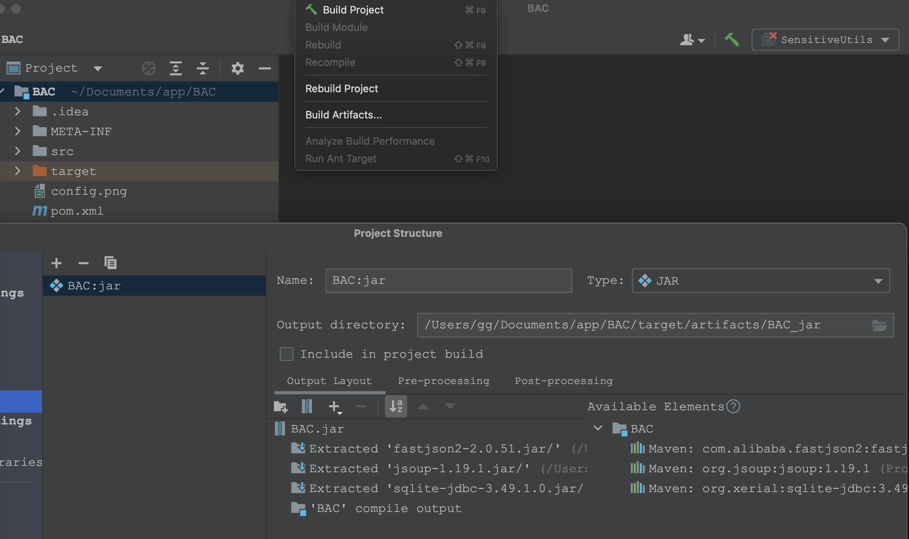

# BAC——自动化辅助越权burp测试插件

- 在日常测试中，越权问题一直较为普遍，不易防护，测试全都依赖手工，检出效率低。
- 在OWASP Top 10:2021中A01 Broken Access Control 排在第一。

---

## 项目介绍

基于burp的montoya api接口，实现burp插件。

检测原理：基于敏感数据和会话信息的主动替换检测。
目前实现手机、身份证、银行卡等敏感数据越权检测。

- 支持敏感数据查询越权检测
- 支持未授权访问检测
- 支持空查询检测

### 界面

- 只检查检测源中的接口
- 登录另一个用户，赋值请求头中的关键会话信息，用于主动替换检测
- 点击"开启检测"才会开始检查，结果显示在proxy-http history的对应记录中。

### 打包

- 如图配置，使用build project方式打包
